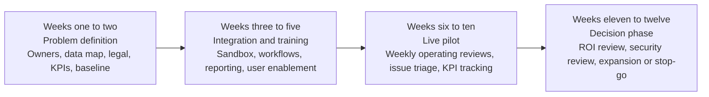

# Startup Opportunities in Direct Partnerships With Professional Sports Teams

## Executive summary

Professional teams already buy from a broad and fast-maturing set of sports-tech startups and startup-origin scaleups across team operations, player performance, scouting, fan engagement, digital content, ticketing, venue access, and sponsorship analytics. Publicly documented examples include Teamworks across essentially all NFL and Premier League clubs, SkillCorner with clubs such as Olympique de Marseille and Everton plus basketball teams like the Orlando Magic, Zone7 with Liverpool and LAFC, Wicket with the Cleveland Browns, Calgary Flames, Mercedes-Benz Stadium, and MLS events, Satisfi Labs with the Minnesota Vikings and Houston Astros, Greenfly with Real Madrid and the NBA, WSC Sports with Club América and MLS, FEVO with multiple NBA, NFL, and MLS teams, and OnePlan with major venue and event operators. citeturn0search7turn7search7turn8search1turn4search12turn4search3turn4search0turn31view1turn6search6turn2search11turn1search7turn11search2turn11search0turn16search0turn10search3turn10search6

The important strategic observation is that this market is **not short on tools**. It is short on **cross-functional systems that turn fragmented data and workflows into measurable business or competitive outcomes**. Public sources repeatedly point to the same structural problems: teams need stronger back offices, better data and analytics, more first-party fan data, better sponsor proof-of-value, and better ways to handle increasingly fragmented media and fan attention. Meanwhile, player workload and travel congestion continue to intensify availability and recovery risk. citeturn23search0turn23search1turn24search0turn24search2turn25search4

That creates a particularly attractive startup pattern: do **not** build another generic “AI for sports” product. Build a narrow, team-facing workflow product that lands with one budget owner, proves ROI in 60 to 90 days, and then expands laterally into adjacent departments. The most compelling white spaces today are fan identity and consent infrastructure, sponsor attribution tied to real transactions, travel-readiness orchestration, explainable transfer and scouting translation, end-to-end venue flow control, and compliance copilots for privacy, biometrics, and commercial rights. This conclusion is an inference from the documented strengths of current vendors and the visible gaps between those tools. citeturn30search5turn30search4turn4search4turn4search12turn22search8turn31view1turn8search1turn17search4

The best near-term go-to-market paths are venture-client structures rather than classic top-down enterprise sales. The clearest public templates are the NBA’s six-month R&D model through NBA Launchpad, MLS’s Innovation Lab real-world testing model, and HYPE’s accelerator-plus-pilot format. These structures reduce procurement friction, create a public validation event, and give teams a controlled way to test innovation without a league-wide roll-out. citeturn26search1turn26search2turn26search3turn27search2

## Current market map of startup partnerships

The table below is a best-effort market map of **publicly verifiable** startup or startup-origin scaleup partnerships relevant to major professional teams and leagues. It is broad, but not exhaustive. Where public materials did not disclose a recent financing round, the funding field is marked as undisclosed.

| Company | Product or service | Public team or league partners | Partnership type | Revenue model | Funding stage | Notable public outcomes |
|---|---|---|---|---|---|---|
| **Teamworks** | Team operations, performance, communications, scouting, intelligence | 100% of NFL, NHL, and Premier League teams; 87% of NBA teams; 83% of MLS teams | Enterprise operating system for sports organizations | Annual SaaS with module expansion and acquisitions | Series F in 2025; later growth investment lifted valuation above $1.5B | Deep penetration across top leagues; acquired PFF’s enterprise business to strengthen football analytics. citeturn0search7turn0search2turn0search0 |
| **SkillCorner** | Broadcast-derived tracking data, physical data, game intelligence for scouting and recruitment | Olympique de Marseille, Everton, Crystal Palace, Orlando Magic, AFA | Official supplier / data partner | Subscription + data licensing | $60M growth investment in 2025 | OM expanded from physical data to Game Intelligence for scouting, recruitment, and tactical analysis. citeturn7search7turn7search4turn7search9turn7search10 |
| **Zone7** | AI injury-risk forecasting, load planning, availability management | Liverpool, LAFC, Napoli, Rangers, QPR | Performance analytics subscription and advisory | SaaS + services | Acquired by svexa in 2024 | Public case studies cite LAFC, Rangers, and QPR; Zone7 highlights a 70% injury reduction case with Getafe. citeturn8search0turn8search1turn29search0turn29search3 |
| **Hytro** | Wearable blood-flow-restriction recovery and performance products | Manchester City Women, Hull City, Perth Glory | Official recovery/performance partner | Hardware + team programs + support | Private, undisclosed | Hytro says it serves 150+ professional teams globally and publishes joint research-style partnership language with clubs. citeturn9search5turn9search0turn9search3turn9search1 |
| **Wicket** | Facial authentication for ticketing, credentialing, payments, and access | Cleveland Browns, Calgary Flames, Mercedes-Benz Stadium, MLS events; NFL staff credentialing across all 32 teams | Venue access and identity platform; official technology partner | Software + integrations + event or venue deployment fees | Private, undisclosed | Wicket says facial ticketing programs can reduce ingress lines by 400%; Browns concessions pilot cut roughly 30 seconds per transaction; MLS expanded its agreement in 2026. citeturn4search4turn4search11turn4search12turn4search3turn4search0turn4search8 |
| **Satisfi Labs** | Agentic AI, fan service, FAQ automation, ticket commerce | Minnesota Vikings, Houston Astros, Dallas Stars, early work with the New York Mets | Conversational AI and commerce deployment | SaaS + commerce and messaging modules | Backed by MLB and Google; growth funding publicly listed | Astros case study reports $232k in in-chat ticket sales and 11,000+ hours saved; Vikings case study reports improved fan satisfaction. citeturn6search2turn30search2turn30search1turn31view1turn6search6 |
| **Greenfly** | Digital media orchestration, athlete content distribution, sponsor and partner asset sharing | Real Madrid, NBA, NHL club package, 500+ teams overall | Team and league content workflow platform | SaaS | $14M financing announced in 2024 | Greenfly reports 90% player activation on team deployments and signed a multi-year NBA deal covering the NBA, WNBA, G League, and NBA Africa. citeturn2search11turn1search7turn2search1turn1search3 |
| **WSC Sports** | AI-powered video creation, highlights, publishing, personalized content | Club América, MLS, LaLiga, ESPN Netherlands with Eredivisie clubs | Multi-year content automation partner | SaaS / enterprise licensing | Series C was last publicly disclosed round | WSC reports LaLiga sessions per user up 70% and year-over-year increase above 30%; Club América renewed and expanded through 2027. citeturn11search0turn11search2turn10search2turn11search10turn11search3 |
| **ScorePlay** | Sports-specific DAM/MAM and media infrastructure | Early co-build with Toulouse FC and AS Monaco; now 50+ U.S. teams, 100+ European clubs, 50+ leagues and federations including MLS and NWSL | Media infrastructure subscription | Annual SaaS + enterprise services | $13M Series A in 2025 | ScorePlay says it serves 300+ sports organizations worldwide and maintained perfect client retention since inception. citeturn12search1turn12search8turn10search5 |
| **Blinkfire** | Sponsorship valuation, media rights analytics, social and broadcast measurement | Pacers Sports & Entertainment, Tampa Bay Lightning, LaLiga, CA Osasuna | Sponsorship analytics platform | SaaS | Private, undisclosed | Blinkfire highlights 8.6B 2023-24 LaLiga video views and cites the Lightning using the platform during helmet sponsorship work. citeturn3search0turn3search3 |
| **FEVO** | Social checkout, group ticketing, flexible offers, commerce tooling | 76ers, Bucks, Buccaneers, Lions, DC United, Chicago Fire, Rapids, Earthquakes, SF Giants, and 800+ brands overall | Ticketing and commerce platform | SaaS + transaction or performance-oriented commerce economics | Series C announced in 2022 | FEVO reports 2.4x conversion vs traditional checkout, 60% net-new customers to partner databases, and 71% incremental sales from sharing tech. citeturn16search0turn16search1turn22search0turn22search3 |
| **Tradable Bits** | First-party fan data capture, gamified activations, audience analysis, sponsor inventory | Trail Blazers, Commanders, Thunder, LA Kings, Columbus Crew, Titans, Mavericks | Fan data and activation platform | SaaS + services + support tiers | Private / self-funded in public materials reviewed | Public materials emphasize 50+ engagement templates, first-party data capture, and sponsor-fulfillment inventory; case materials feature Mavericks and Thunder. citeturn19search0turn19search1turn31view4turn30search3 |
| **OnePlan** | Collaborative event planning and venue digital twins | Paris 2024 sport operations, Commonwealth Stadium | Venue planning software and digital twin licensing | License + implementation | Series A | Paris 2024 used OnePlan across 46 business units with reported 80% time savings; Commonwealth Stadium used VenueTwin for integrated planning and commercial uses. citeturn10search6turn10search0turn10search3turn22search6 |
| **Horizm** | Digital inventory valuation, packaging, and monetization for social and digital sponsorship | Real Madrid, Chelsea, Arsenal, Everton | Rights-holder digital commercial platform | SaaS + analytics / marketplace-style monetization | Private, undisclosed | Horizm says it manages more than $7B in digital inventory and showcases Real Madrid as a co-innovation case. citeturn20search2turn20search7turn30search4turn30search6 |
| **Olocip** | AI scouting, player performance prediction, squad planning, fan data infrastructure | RC Deportivo, Toluca FC, RCD Espanyol, Cádiz CF | Sporting department AI and digital data partner | Software + custom implementations | Integrated into Plexus Sport | RC Deportivo renewed ahead of its return to La Liga; Espanyol used Olocip in Perico ID, its single-sign-on and fan identity project. citeturn17search4turn17search0turn17search5turn17search7 |

Two patterns stand out from this map. First, teams overwhelmingly buy **point solutions** with obvious departmental owners: performance staff buy performance tools, digital teams buy media tools, ticketing teams buy conversion tools, and venue operations teams buy access or planning tools. Second, many of the most successful companies win by starting as a narrow point solution and then widening into adjacent workflows, exactly as Teamworks, WSC Sports, FEVO, Satisfi Labs, and ScorePlay have done. citeturn0search0turn11search9turn22search12turn30search10turn12search2

## Team pain points and the most important white spaces

Across leagues and sports, the most recurring problems are now less about “getting software” and more about **connecting fragmented workflows to measurable outcomes**. Deloitte’s outlook explicitly highlights stronger back offices, greater competition for fan attention, more importance of fan data, and the tension between monetization and privacy. FIFPRO’s workload reporting highlights excessive player load and insufficient rest safeguards. Hub research summarized in trade publications shows mounting fan frustration with fragmented viewing and discovery. citeturn23search0turn23search1turn24search0turn24search2turn25search4

### Prioritized pain points

| Priority | Pain point | Why teams care now | Public evidence |
|---|---|---|---|
| **Highest** | **Fragmented fan data and weak identity resolution** | Teams need first-party data for marketing, ticketing, and sponsorship, but data sits across ticketing, CRM, apps, commerce, and content systems. | Deloitte flags first-party data strategy and privacy as strategic questions; Tradable Bits and Horizm both position themselves around getting fan data out of fragmented systems and monetizing it. citeturn23search1turn30search5turn30search4 |
| **Highest** | **Sponsor activation attribution is still weak** | Sponsors increasingly want real business outcomes, not just logo presence or media-equivalency reports. | Blinkfire, Horizm, and SponsorUnited all emphasize valuation, pricing transparency, and activation intelligence, which is itself evidence that this pain point remains unresolved. citeturn3search0turn20search0turn14search1turn14search6 |
| **Highest** | **Player availability under congested schedules and travel** | Elite calendars are denser, travel is heavier, and top players are more expensive assets than ever. | FIFPRO reports excessive workload and demand for rest safeguards; Zone7 explicitly frames injuries as a major performance disruptor; FIFA’s 2026 calendar adds another dense cycle. citeturn24search0turn24search2turn29search0turn24search1 |
| **High** | **Scouting and roster decisions remain siloed from contextual fit** | Clubs want more than raw scouting grades. They need role fit, tactical fit, availability risk, and price discipline. | Teamworks’ PFF and Telemetry moves, SkillCorner’s Game Intelligence, and Olocip’s predictive scouting show heavy demand for integrated decision support. citeturn0search0turn0search4turn7search7turn17search4 |
| **High** | **Content operations are faster, but not fully monetized** | Teams now publish constantly across owned media, short-form social, apps, and sponsor channels, but monetization and rights-safe attribution still lag. | Greenfly, WSC, and ScorePlay all sell around this pain. WSC’s Club América and LaLiga examples show the value of scaled output, but not yet full closed-loop commercialization. citeturn2search10turn11search2turn12search8 |
| **High** | **Venue flow is still broken end-to-end** | Ingress, premium entry, concessions, credentialing, parking, and staffing are typically solved separately. | Wicket addresses identity and access; OnePlan addresses planning; neither public case set shows a complete, real-time operating layer across the full venue journey. citeturn4search4turn4search12turn10search3turn10search6 |
| **High** | **Ticketing still loses fans on conversion and service** | Teams need easier last-minute buying, flexible packages, group sales, and better self-service support. | FEVO’s conversion metrics and Satisfi Labs’ Astros case both show that commerce friction is still meaningful enough to create material uplift when addressed. citeturn16search1turn31view1 |
| **Moderate to high** | **Cross-functional team operations are fragmented** | Coaches, scouts, medical staff, operations staff, and executives still work across separate systems. | Teamworks’ growth and acquisitions were explicitly justified by the pain of fragmented sports workflows. citeturn0search0turn0search4 |
| **Moderate to high** | **Biometric, privacy, and data-governance complexity is rising** | More products touch sensitive fan and player data, including biometrics and health-linked information. | Deloitte highlights privacy-vs-data sharing tension; Wicket brands itself as privacy-first facial authentication. citeturn23search1turn4search8 |
| **Moderate** | **Media discovery and fan-viewing fragmentation hurt engagement** | Fans increasingly need help finding where to watch, which reduces smooth continuity between broadcast, app, highlights, and commerce. | Hub’s 2026 study found 87% of sports fans at least somewhat frustrated figuring out where to watch. citeturn25search4 |

### Where the biggest gaps remain

The strongest white spaces are not places with zero vendors. They are places where current vendors solve **one slice** of the workflow but leave the team to stitch together the rest.

| Gap | Why current solutions underperform | Best first buyer | Why this is attractive |
|---|---|---|---|
| **Unified fan identity, consent, and activation layer** | CRM, ticketing, app, commerce, sponsor, and content systems remain separate. Tradable Bits, FEVO, Satisfi, and Horizm each solve part of the problem, not the identity-and-consent fabric across all of it. citeturn30search5turn16search1turn31view1turn20search0 | CMO, Chief Digital Officer, CIO | Direct revenue and sponsor value; hard to rip out once embedded |
| **Sponsor proof-of-outcome beyond media value** | Blinkfire, Horizm, and SponsorUnited improve valuation and benchmarking, but teams still struggle to connect activations to transactions, lead quality, or LTV. citeturn3search0turn20search0turn14search6 | CRO, SVP Partnerships | Sponsorship budgets are large and outcome proof wins renewals |
| **Travel-readiness orchestration** | Zone7 and Hytro address parts of recovery and risk, but public solutions still look fragmented across sleep, customs, charter planning, recovery protocols, and return-to-performance scheduling. citeturn29search0turn9search3 | Head of Performance, Director of Team Operations | Acute ROI in NBA, NHL, MLS, global football, and touring competitions |
| **Explainable scouting translation across leagues and systems** | SkillCorner and Olocip are strong, but current public positioning still centers on data and prediction more than explainable decision workflows tied to tactical role, salary, injury, and adaptation risk. citeturn7search7turn17search4 | GM, Sporting Director, Director of Recruitment | One good transfer can validate the product economically |
| **Full-funnel content-to-commerce** | Greenfly, WSC, and ScorePlay accelerate content flow, but few public products clearly close the loop from content asset to attributable ticket, merch, sponsor, or membership conversion. citeturn2search10turn11search9turn12search8 | CMO, Head of Content, Digital Commerce Lead | Fits the “becoming a media company” strategy many clubs now pursue |
| **End-to-end venue flow control** | Wicket solves access; OnePlan solves planning; teams still lack a live operating layer for flow, staffing, premium zones, parking, concessions, and incident response. citeturn4search4turn10search3 | Chief Venue Officer, Stadium GM | Strong ops ROI and visible fan-experience impact |
| **Compliance copilots for privacy, rights, biometrics, and commercial approvals** | Teams use legal teams, templates, and point tools, but there is little visible dedicated software for sports-specific workflow compliance. | GC, COO, Compliance Lead | High pain, low glamour, low competition |
| **Academy-to-first-team development graph** | Current tools often split academy analytics, medical systems, and first-team scouting. Public materials show lots of performance tools but little integrated pathway product. | Academy Director, Sporting Director | Strong wedge in football, MLS, and multi-team ownership groups |
| **Women-specific load and readiness models** | Many public solutions are generalized; the public case volume for women’s teams is still comparatively thin. | Head of Sports Science, Women’s Team GM | Growing market with less incumbency and increasing investment |

The synthesis is straightforward: the **next strong startup** will probably not look like “another analytics platform.” It will look like a **workflow unifier** sitting above multiple existing data sources and proving business or competitive value in one measurable motion.

## Concrete startup concepts that fit those gaps

The concepts below are deliberately written as **team-partnership-first** companies, not consumer apps. TAM and SAM figures are directional estimates, not audited market sizes. In sports-tech, the real near-term SAM for most team-facing enterprise products is often in the **tens of millions** of annual recurring revenue, because there are relatively few top-tier buyers. The way to build a large company is to win that core SAM first, then expand into leagues, federations, secondary divisions, adjacent venues, brands, or colleges. That pattern is visible in Teamworks, FEVO, WSC Sports, Greenfly, and ScorePlay. citeturn0search7turn16search1turn11search9turn2search3turn10search5

| Idea | Core value proposition | Target buyer | High-level TAM and SAM estimate | Landing strategy for team partnerships | Revenue model | Key risks |
|---|---|---|---|---|---|---|
| **Fan Identity Mesh** | Create a single fan identity and consent graph across ticketing, CRM, app, merch, Wi-Fi, content, and sponsor activations | CMO, Chief Digital Officer, CIO | **Core SAM:** ~150 to 250 top clubs and venues paying $150k to $500k ARR; **expanded TAM:** leagues, colleges, arenas, and sponsors can push category above $250M | Start with one use case such as season-ticket renewal or sponsor audience segmentation; integrate with existing CRM and ticketing instead of replacing them | Platform fee + implementation + data enrichment tiers | Heavy integrations, privacy liability, dependence on third-party systems |
| **Sponsor Outcome OS** | Connect sponsor inventory to attributable business outcomes such as lead capture, transactions, dwell time, app action, and content engagement | CRO, SVP Partnerships, Partnership Analytics Lead | **Core SAM:** ~200 pro properties at $200k to $600k ARR + brand-side analytics | Begin with one sponsor category, one venue zone, and one digital inventory class; prove renewal or upsell impact before expanding | SaaS + optional performance or success fees | Needs careful data-sharing rules; sponsor and team systems may not align |
| **Travel Readiness Planner** | Combine travel, sleep, recovery, training load, hotel, nutrition, customs, and match calendar into a daily readiness engine | Director of Team Operations, Head of Performance | **Core SAM:** ~100 to 180 travel-intensive clubs at $100k to $350k ARR | Sell into MLS, NBA, NHL, global football, and women’s teams with heavy travel; pilot around an away-game block or tournament window | SaaS + per-trip optimization + white-glove services | Operational complexity, limited tolerance for bad recommendations |
| **Explainable Transfer Engine** | Turn scouting data into role-fit, league-fit, adaptation-risk, wage-fit, and resale-value recommendations with human-readable rationale | GM, Sporting Director, Head of Recruitment | **Core SAM:** ~120 to 200 clubs at $150k to $500k ARR | Start with one transfer window and one position group; provide shadow recommendations alongside the club’s existing process | Seat licenses + club license + optional success retainer | Hard to earn trust, potential blame if a transfer disappoints |
| **Venue Flow Orchestrator** | Live decision layer for ingress, parking, security, premium lanes, concessions, and staffing | Stadium GM, Chief Venue Officer | **Core SAM:** ~100 to 150 major venues at $200k to $750k ARR | Land through premium or VIP entry pilot where ROI is easiest to see; expand to whole-venue ops once value is proven | SaaS + integration fee + optional uptime SLA and support | Hardware and camera integration, incident liability, procurement cycles |
| **Content-to-Commerce Router** | Turn every highlight, behind-the-scenes asset, or creator clip into a rights-safe path to tickets, merch, or sponsor commerce | CMO, Head of Content, Digital Commerce Lead | **Core SAM:** ~150 to 250 clubs at $100k to $400k ARR | Integrate with existing content stack like Greenfly, ScorePlay, or WSC instead of competing initially; prove uplift on a single campaign or player cluster | SaaS + commerce take-rate | Rights complexity, attribution disputes, platform algorithm dependence |
| **Sports Compliance Copilot** | Workflow engine for biometric consent, ticketing and privacy rules, image rights, sponsored post approvals, gambling/alcohol category rules, and fan-data sharing | General Counsel, COO, Compliance Lead | **Core SAM:** smaller but sticky, ~80 to 150 major properties at $100k to $300k ARR | Sell an annual compliance audit + pilot package before converting to software; strongest in teams with international reach or biometric tech | Subscription + jurisdiction modules + advisory upsells | Legal exposure, slow-moving procurement, requires deep domain expertise |
| **Academy Pathway Graph** | One player-development graph from academy to reserve to first team, integrating training, video, medical, and tactical progression | Academy Director, Sporting Director, Head of Methodology | **Core SAM:** ~100 to 180 football clubs and ownership groups at $125k to $400k ARR | Start in football where academy value is highest; pilot with one age cohort and first-team benchmark model | Annual club-group license + setup | Long validation windows, fragmented underlying data quality |
| **Women’s Performance Intelligence Stack** | Readiness, injury-risk, scheduling, and return-to-play workflows tuned specifically for women’s pro environments | Head of Sports Science, Women’s Team GM | **Core SAM:** fast-growing, initially ~75 to 150 women’s teams and federations at $75k to $250k ARR | Start in women’s football and basketball where growth and strategic investment are strong; win a visible flagship club | SaaS + scientific services | Need credible science, small initial buyer pool, high evidence burden |
| **Premium Yield and Hospitality Engine** | Optimize bundles of suites, clubs, parking, food, guest lists, and premium experiences for B2B buyers and sponsor hosts | Chief Revenue Officer, Premium Sales Lead | **Core SAM:** ~120 to 200 premium-heavy venues and clubs at $150k to $500k ARR | Run a seasonal pilot on underfilled premium inventory; connect digital buying and host management | SaaS + success fee on incremental premium revenue | Ticketing integrations, channel conflict with sales teams |
| **Biometric Trust Layer** | Neutral, privacy-first identity and permission layer for facial entry, facial pay, and staff credentialing | CIO, Venue Ops, Legal | **Core SAM:** ~75 to 120 top venues and clubs at $200k to $700k ARR | Partner with ticketing and access providers instead of going direct alone; launch in premium and staff zones before general admission | Platform fee + integration + support | Regulatory scrutiny, reputational risk, vendor lock-in concerns |

### Which ideas are most attractive first

If the goal is to build a venture-scale company around direct team partnerships, the three ideas I would prioritize first are **Fan Identity Mesh**, **Sponsor Outcome OS**, and **Travel Readiness Planner**.

The reason is practical. These ideas sit where budgets are growing, pain is visible, and current solutions remain fragmented. They also produce cleaner pilot metrics than many purely “AI scouting” or “general fan engagement” products. In enterprise sports-tech, the best founder story is usually: *we improved one KPI that already matters to a named buyer*. Public market behavior strongly supports that framing. Teams have already shown willingness to buy narrowly defined solutions for access, ticketing, media orchestration, and performance. citeturn4search4turn31view1turn1search7turn11search2turn7search7

## Commercial structures and a practical pilot model

### Structures teams already use

Public deal terms are often only partially disclosed, but the structures themselves are visible.

| Structure | How it shows up in the market | Public examples | Practical implication |
|---|---|---|---|
| **Pilot or R&D project** | Fixed-term testing with limited scope, measured against defined outcomes | NBA Launchpad uses a six-month R&D project within an NBA property; MLS Innovation Lab gives startups real-world testing with league and club access; HYPE Inside Track explicitly offers a pilot with a leading brand or club. citeturn26search1turn26search2turn27search2 | Best structure for first sale; lower legal and procurement friction |
| **Annual SaaS or licensing deal** | Team licenses software and may add services or implementation | SkillCorner as official supplier to OM; Teamworks as operating system; WSC and ScorePlay as ongoing media infrastructure. citeturn7search7turn0search7turn11search2turn12search8 | Most scalable after proof-of-value is established |
| **Official supplier or technology partnership** | Vendor is positioned publicly as a partner, often with branding rights | Hytro with Manchester City Women and Hull City; Wicket at Mercedes-Benz Stadium; Socios with the 76ers. citeturn9search5turn9search0turn4search12turn21search8 | Useful when the team wants innovation plus a public story |
| **Commerce or performance-based fee** | Vendor economics tied to ticket sales, transactions, or measurable conversion | FEVO is explicitly built around selling more via social checkout; Satisfi’s Astros case shows attributable in-chat ticket sales, though exact fee percentages were not publicly disclosed. citeturn16search1turn31view1 | Strong for buyer alignment, but finance teams will demand precise attribution rules |
| **Equity plus commercial relationship** | Strategic investor also becomes customer or partner | NBA Equity invested in Greenfly as part of Greenfly’s 2024 financing around its NBA relationship; HYPE Inside Track offers startup investment plus pilot access. citeturn1search7turn27search2 | Powerful signal, but can slow cap-table decisions and distort pricing if handled badly |
| **Sponsorship overlay** | Startup pays for visibility or secures rights that also support product adoption | Socios’ 76ers deal included TV-visible signage and digital presence; Wicket became “Proud Partner of Technology” at Mercedes-Benz Stadium. citeturn21search8turn4search12 | Attractive if the startup also wants brand exposure, but dangerous if it masks weak product fit |

### Negotiation advice for founders

The most useful rule is simple: **sell a pilot around one budget line and one KPI**. If the pitch needs three departments to agree before value exists, the deal is too broad.

A good first team deal should do six things clearly.

It should define the use case in one sentence. It should identify one executive sponsor and one day-to-day operator. It should specify exactly which systems and datasets are in scope. It should define success in hard numbers. It should include a conversion path to a paid contract if KPIs are met. And it should sharply limit exclusivity and data-rights ambiguity.

The clauses founders most often underprice are data rights, benchmarking rights, support burden, and implied exclusivity. If the team wants exclusivity by sport, league, market, or use case, that should be paid for separately. If you need logos or a public case study, negotiate that before the pilot starts, not after the team gets value.

### A recommended ninety-day pilot template

The best public pilot structures in sports innovation use three principles: real-world deployment, controlled scope, and post-pilot evaluation. That is exactly how NBA Launchpad and MLS Innovation Lab are designed. citeturn26search1turn26search2turn26search3

A practical 90-day pilot should look like this:

| Phase | Team responsibilities | Startup responsibilities | Deliverables |
|---|---|---|---|
| **Alignment** | Appoint executive sponsor, day-to-day owner, legal owner, and systems owner | Define precise workflow, success metrics, implementation plan | Pilot brief, RACI, KPI baseline, data-access checklist |
| **Integration** | Provide system access, sandbox credentials, and required approvals | Build integrations, configure dashboards, train users | Live environment, user training, support SLA |
| **Live pilot** | Use the product in real workflow, attend weekly reviews, surface blockers fast | Monitor usage, fix issues, document ROI weekly, adapt playbooks | Weekly KPI report, issue log, adoption report |
| **Evaluation** | Decide on conversion, budget owner, and expansion scope | Present before/after analysis and commercial proposal | Final business case, expansion roadmap, paid contract draft |

For sports buyers, the KPI language should vary by domain.

| Domain | Best pilot KPIs |
|---|---|
| **Ticketing / fan service** | Conversion rate, assisted revenue, self-service rate, response time, deflected calls |
| **Performance** | Player availability, soft-tissue injury days lost, training compliance, return-to-play time |
| **Scouting** | Analyst hours saved, shortlist precision, decision cycle time, transfer hit rate proxy |
| **Venue operations** | Entry time, queue time, throughput, staffing variance, premium-lane utilization |
| **Sponsorship** | Attributable leads, clickthrough, dwell time, commerce conversion, renewal confidence |
| **Content** | Publish speed, asset reuse, share rate, sponsor asset delivery time, attributable downstream action |

The strongest pilot design principle is to include a **pre-agreed expansion trigger**. Example: if the team sees a 15% reduction in average premium-lane entry time, or $100k in attributable assisted ticket revenue, the pilot automatically converts to a one-year paid deployment at a pre-negotiated price band. That reduces the “we love it but need to think about budget next quarter” problem.

## Recommended next steps and resources

If I were prioritizing this opportunity set for a founder starting now, I would take the following path.

First, choose **one buyer persona** and one workflow. Not “pro teams” broadly. Not “fan engagement” broadly. Something like: *director of team operations at travel-heavy clubs*, or *SVP of partnerships at teams with seven-figure sponsorship books*, or *chief digital officer at clubs trying to unify first-party fan identity*. The fastest way to fail in sports-tech is to make five departments “kind of interested” instead of making one department unable to ignore you.

Second, choose a **beachhead sport** based on openness to pilots, not just market glamour. MLS is unusually founder-friendly because the league has an explicit innovation lab and a recent track record of testing technologies in fan engagement, media, and on-field development. The NBA is also attractive because Launchpad is designed precisely to source and test emerging technologies in player health, media, and fan connection. citeturn26search2turn26search3turn26search1

Third, bring a **venture-client package**, not just a sales deck. That package should include the pilot brief, KPI baseline template, sample data map, privacy/security FAQ, implementation calendar, and a one-page “pilot-to-paid” commercial path. Teams are increasingly professionalized and under pressure to justify tech spend, so make the purchase decision easy for them. citeturn23search0turn23search1

Fourth, build around the existing stack instead of fighting it. The public winners in this market often integrate with ticketing, DAM, storage, payment, or CRM systems rather than replacing them on day one. FEVO, Wicket, Satisfi Labs, OnePlan, Greenfly, and ScorePlay all benefit from fitting into surrounding systems. citeturn4search4turn22search2turn31view1turn10search6turn2search3turn12search4

### Most useful resources

| Resource | Why it matters |
|---|---|
| **NBA Launchpad** | Best public template for startup selection, R&D pilots, and broader strategic partnership evaluation inside a top league. citeturn26search1turn26search0 |
| **MLS Innovation Lab** | Particularly relevant if your product touches fan engagement, media tech, or player development. It is explicitly designed for real-world testing access. citeturn26search2turn26search3turn26search5 |
| **HYPE Sports Innovation** | Useful for founders who need pilot access and structured credibility; HYPE Inside Track publicly offers funding plus guaranteed pilot exposure. citeturn27search1turn27search2 |
| **Stadia Ventures** | Large sports-tech network, accelerator history, and pre-Series A positioning for founders who need introductions and category-specific investors. citeturn28search1 |
| **Public case-study libraries from incumbents** | Teamworks, Wicket, Satisfi Labs, WSC Sports, SkillCorner, and OnePlan together provide a practical playbook for how teams describe ROI and justify spend. citeturn0search0turn4search4turn31view1turn11search2turn7search7turn10search6 |

### Prioritized next steps

For actual execution, I would prioritize the following sequence:

| Horizon | Action | Why it comes first |
|---|---|---|
| **Immediate** | Pick one of the top three white spaces: fan identity mesh, sponsor outcome OS, or travel readiness planner | These have the cleanest ROI story and the least direct saturation |
| **Immediate** | Build a 2-page pilot brief and KPI calculator | Teams buy clearer outcomes, not bigger visions |
| **Immediate** | Create a target list of 30 potential design partners across one sport and one buyer persona | Sports is relationship-driven; narrow targeting beats volume |
| **Near-term** | Pursue league innovation channels in parallel with direct club outreach | League-backed pilots reduce credibility risk |
| **Near-term** | Pre-negotiate integration paths with one CRM, one ticketing stack, and one data warehouse or storage partner | Integration risk is a hidden blocker in almost every sports-tech sale |
| **Near-term** | Secure one public case study clause before pilot launch | Referenceability compounds faster in sports than in many other B2B categories |
| **Medium-term** | Expand from one department to adjacent budgets only after proving the initial wedge | This is how many of the most successful sports-tech companies have scaled |

### Open questions and limitations

This report is grounded primarily in official company, league, team, and case-study materials, supplemented where necessary by reputable industry analysis. Exact commercial terms and fee percentages are often not public in sports-tech deals, so the **structure** of partnerships is usually visible while the precise economics are not. A few companies in the market map also do **not** publicly disclose a recent financing round in the company materials reviewed, so those entries are marked as undisclosed rather than guessed. citeturn26search1turn26search2turn27search2turn22search8

The most important conclusion is still high-confidence: there is real opportunity here, but the winning startup is unlikely to be a generic platform. It is more likely to be a workflow-specific, ROI-verifiable wedge that helps a team turn fragmented sports operations into a single measurable outcome.